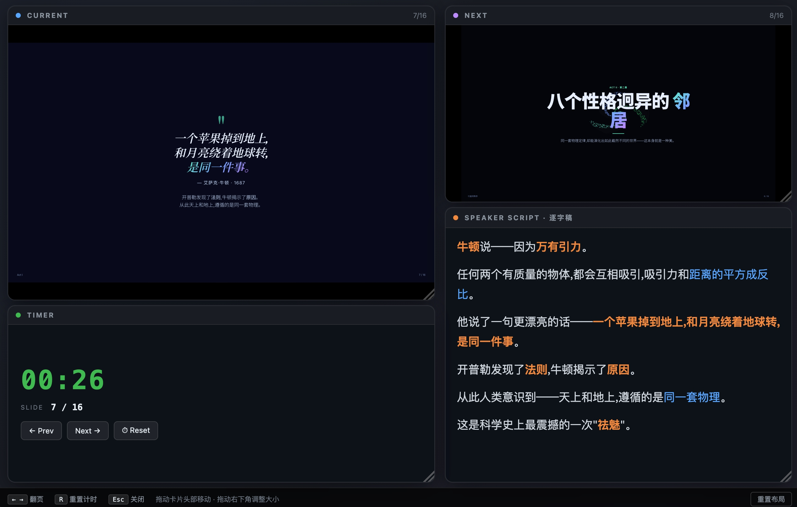
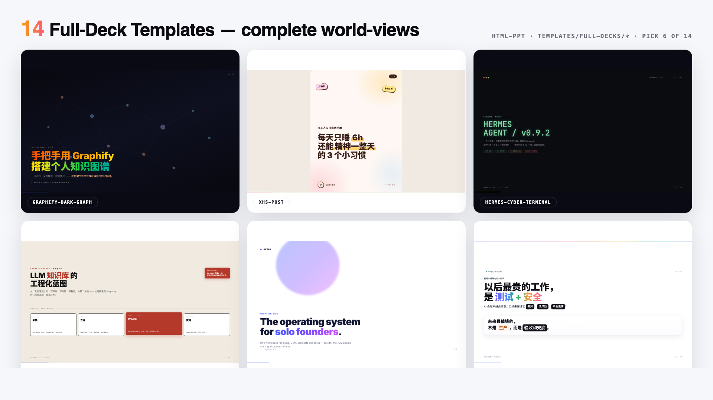
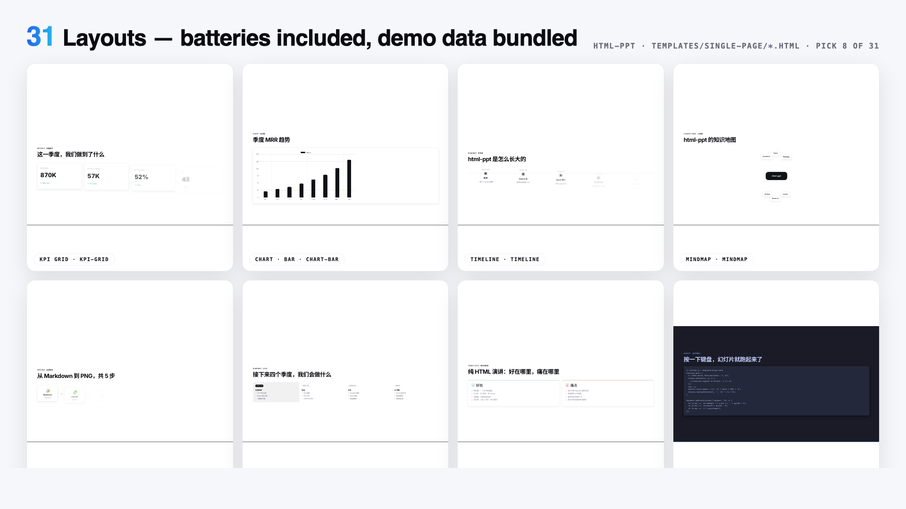

# ostar-all-in-html-ppt — All-in-One HTML PPT Studio

> A world-class AgentSkill for producing professional HTML presentations in
> **36 themes**, **15 full-deck templates**, **31 page layouts**,
> **47 animations** (27 CSS + 20 canvas FX), a **true presenter mode**
> with pixel-perfect previews + speaker script + timer, and a **built-in
> PDF/SVG export** with thumbnail picker — all pure static HTML/CSS/JS,
> no build step.

🚀 Forked from [lewislulu/html-ppt-skill](https://github.com/lewislulu/html-ppt-skill) with built-in P-key PDF/SVG export.
**中文文档:** [README.md](README.md)


> One command installs **36 themes × 20 canvas FX × 31 layouts × 15 full decks + presenter mode + PDF/SVG export**. Every preview above is a live iframe of a real template file rendering inside the deck — no screenshots, no mock-ups.

## 🎤 Presenter Mode (new!)

Press `S` on any deck to pop open a dedicated presenter window with four
draggable, resizable **magnetic cards**: current slide, next slide preview,
speaker script (逐字稿), and timer. Two windows stay in sync via
`BroadcastChannel`.



**Why previews are pixel-perfect:** each card is an `<iframe>` that loads the
same deck HTML with a `?preview=N` query param. The runtime detects this and
renders only slide N with no chrome — so the preview uses the **same CSS,
theme, fonts and viewport** as the audience view. Colors and layout are
guaranteed identical.

**Smooth (no-reload) navigation:** on slide change, the presenter window
sends `postMessage({type:'preview-goto', idx:N})` to each iframe. The iframe
just toggles `.is-active` between slides — **no reload, no flicker**.

**Speaker script rules (3 golden):**
1. **Prompt signals, not lines to read** — bold the keywords, separate
   transition sentences into their own paragraphs
2. **150–300 words per slide** — that's the ~2–3 min/page pace
3. **Write it like you speak** — conversational, not written prose

See [`references/presenter-mode.md`](references/presenter-mode.md) for the
full authoring guide, or copy the ready-made template at
`templates/full-decks/presenter-mode-reveal/` which ships with full 150-300
word speaker scripts on every slide.

## 📄 PDF / SVG Export (new!)

Press `P` on any deck to open the **export dialog** with a thumbnail grid:

- **Select slides** by clicking thumbnails, with Select All / Deselect All
- **📥 Export PDF**: Uses browser native print (`@page{size:1920px 1080px}` exact 16:9). Choose "Save as PDF" → Landscape in Chrome.
- **📦 Export SVG (.zip)**: Each slide as an independent SVG file (`foreignObject` + full CSS), packaged via JSZip.

> PDF uses the browser's native rendering engine — styles, colors, gradients, and fonts match the screen perfectly. SVGs can be opened and edited in any browser.

## Install (one command)

```bash
npx skills add https://github.com/ostar999/ostar-all-in-html-ppt.git
```

That registers the skill with your agent runtime. After install, any agent
that supports AgentSkills can author presentations by asking things like:

> "做一份 8 页的技术分享 slides，用 cyberpunk 主题"
> "turn this outline into a pitch deck"
> "做一个小红书图文，9 张，白底柔和风"

## What's in the box

| | Count | Where |
|---|---|---|
| 🎤 **Presenter mode** | **NEW** | `S` key / `?preview=N` |
| 📄 **PDF/SVG export** | **NEW** | `P` key / `runtime.js` |
| 🎨 **Themes** | **36** | `assets/themes/*.css` |
| 📑 **Full-deck templates** | **15** | `templates/full-decks/<name>/` |
| 🧩 **Single-page layouts** | **31** | `templates/single-page/*.html` |
| ✨ **CSS animations** | **27** | `assets/animations/animations.css` |
| 💥 **Canvas FX animations** | **20** | `assets/animations/fx/*.js` |
| 🖼️ **Showcase decks** | 4 | `templates/*-showcase.html` |
| 📸 **Verification screenshots** | 56 | `scripts/verify-output/` |

### 36 Themes

`minimal-white`, `editorial-serif`, `soft-pastel`, `sharp-mono`, `arctic-cool`,
`sunset-warm`, `catppuccin-latte`, `catppuccin-mocha`, `dracula`, `tokyo-night`,
`nord`, `solarized-light`, `gruvbox-dark`, `rose-pine`, `neo-brutalism`,
`glassmorphism`, `bauhaus`, `swiss-grid`, `terminal-green`, `xiaohongshu-white`,
`rainbow-gradient`, `aurora`, `blueprint`, `memphis-pop`, `cyberpunk-neon`,
`y2k-chrome`, `retro-tv`, `japanese-minimal`, `vaporwave`, `midcentury`,
`corporate-clean`, `academic-paper`, `news-broadcast`, `pitch-deck-vc`,
`magazine-bold`, `engineering-whiteprint`.


Each is a pure CSS-tokens file — swap one `<link>` to reskin the entire deck.
Browse them all in `templates/theme-showcase.html` (each slide rendered in an
isolated iframe so theme ≠ theme is visually guaranteed).



### 15 Full-deck templates

Eight extracted from real-world decks, seven generic scenario scaffolds:

**Extracted looks**
- `xhs-white-editorial` — 小红书白底杂志风
- `graphify-dark-graph` — 暗底 + 力导向知识图谱
- `knowledge-arch-blueprint` — 蓝图 / 架构图风
- `hermes-cyber-terminal` — 终端 cyberpunk
- `obsidian-claude-gradient` — 紫色渐变卡
- `testing-safety-alert` — 红 / 琥珀警示风
- `xhs-pastel-card` — 柔和马卡龙图文
- `dir-key-nav-minimal` — 方向键极简

**Scenario decks**
- `pitch-deck`, `product-launch`, `tech-sharing`, `weekly-report`,
  `xhs-post` (9-slide 3:4), `course-module`,
  **`presenter-mode-reveal`** 🎤 — complete talk template with full 150-300
  word speaker scripts on every slide, designed around the `S` key presenter mode

Each is a self-contained folder with scoped `.tpl-<name>` CSS so multiple
decks can be previewed side-by-side without collisions. Browse the full
gallery in `templates/full-decks-index.html`.



### 31 Single-page layouts

cover · toc · section-divider · bullets · two-column · three-column ·
big-quote · stat-highlight · kpi-grid · table · code · diff · terminal ·
flow-diagram · timeline · roadmap · mindmap · comparison · pros-cons ·
todo-checklist · gantt · image-hero · image-grid · chart-bar · chart-line ·
chart-pie · chart-radar · arch-diagram · process-steps · cta · thanks

Every layout ships with realistic demo data so you can drop it into a deck
and immediately see it render.


*The big iframe is loading `templates/single-page/<name>.html` directly and cycling through all 31 layouts every 2.8 seconds.*


### 27 CSS animations + 20 Canvas FX

**CSS (lightweight)** — directional fades, `rise-in`, `zoom-pop`, `blur-in`,
`glitch-in`, `typewriter`, `neon-glow`, `shimmer-sweep`, `gradient-flow`,
`stagger-list`, `counter-up`, `path-draw`, `morph-shape`, `parallax-tilt`,
`card-flip-3d`, `cube-rotate-3d`, `page-turn-3d`, `perspective-zoom`,
`marquee-scroll`, `kenburns`, `ripple-reveal`, `spotlight`, …

**Canvas FX (cinematic)** — `particle-burst`, `confetti-cannon`, `firework`,
`starfield`, `matrix-rain`, `knowledge-graph` (force-directed physics),
`neural-net` (signal pulses), `constellation`, `orbit-ring`, `galaxy-swirl`,
`word-cascade`, `letter-explode`, `chain-react`, `magnetic-field`,
`data-stream`, `gradient-blob`, `sparkle-trail`, `shockwave`,
`typewriter-multi`, `counter-explosion`. Each is a real hand-rolled canvas
module auto-initialised on slide enter via `fx-runtime.js`.

## Quick start (manual, after install or git clone)

```bash
# Scaffold a new deck from the base template
./scripts/new-deck.sh my-talk

# Browse everything
open templates/theme-showcase.html         # all 36 themes (iframe-isolated)
open templates/layout-showcase.html        # all 31 layouts
open templates/animation-showcase.html     # all 47 animations
open templates/full-decks-index.html       # all 15 full decks

# Render any template to PNG via headless Chrome
./scripts/render.sh templates/theme-showcase.html
./scripts/render.sh examples/my-talk/index.html 12
```

## Keyboard cheat sheet

```
← → Space PgUp PgDn Home End   navigate
F                               fullscreen
S                               open presenter window (magnetic cards)
P                               export dialog — select slides → PDF / SVG (.zip)
N                               quick notes drawer (bottom)
R                               reset timer (in presenter window)
O                               slide overview grid
T                               cycle themes (syncs to presenter)
A                               cycle a demo animation on current slide
Esc                             close all overlays
#/N (URL)                       deep-link to slide N
?preview=N (URL)                preview-only mode (single slide, no chrome)
```

## Project structure

```
ostar-all-in-html-ppt/
├── SKILL.md                      agent-facing dispatcher
├── README.md                     Chinese README (default)
├── README.EN.md                  this file
├── references/                   detailed catalogs
│   ├── themes.md                 36 themes with when-to-use
│   ├── layouts.md                31 layout types
│   ├── animations.md             27 CSS + 20 FX catalog
│   ├── full-decks.md             15 full-deck templates
│   ├── presenter-mode.md         🎤 presenter mode + speaker script guide
│   └── authoring-guide.md        full workflow
├── assets/
│   ├── base.css                  shared tokens + primitives
│   ├── fonts.css                 webfont imports
│   ├── runtime.js                keyboard + presenter + export + overview
│   ├── themes/*.css              36 theme token files
│   └── animations/
│       ├── animations.css        27 named CSS animations
│       ├── fx-runtime.js         auto-init [data-fx] on slide enter
│       └── fx/*.js               20 canvas FX modules
├── templates/
│   ├── deck.html                 minimal starter
│   ├── theme-showcase.html       iframe-isolated theme tour
│   ├── layout-showcase.html      all 31 layouts
│   ├── animation-showcase.html   47 animation slides
│   ├── full-decks-index.html     15-deck gallery
│   ├── full-decks/<name>/        15 scoped multi-slide decks
│   └── single-page/*.html        31 layout files with demo data
├── scripts/
│   ├── new-deck.sh               scaffold
│   ├── render.sh                 headless Chrome → PNG
│   └── verify-output/            56 self-test screenshots
├── examples/
│   ├── demo-deck/                  complete working deck
│   └── export-reference/           P-key export reference template
```

## Philosophy

- **Token-driven design system.** All color, radius, shadow, font decisions
  live in `assets/base.css` + the current theme file. Change one variable,
  the whole deck reflows tastefully.
- **Iframe isolation for previews.** Theme / layout / full-deck showcases all
  use `<iframe>` per slide so each preview is a real, independent render.
- **Zero build.** Pure static HTML/CSS/JS. Webfonts via Google Fonts CDN, SVG export loads JSZip CDN on demand.
- **Senior-designer defaults.** Opinionated type scale, spacing rhythm,
  gradients and card treatments — no "Corporate PowerPoint 2006" vibes.
- **First-class Chinese + English support.** Noto Sans SC / Noto Serif SC pre-imported.

## License

MIT © 2026 ostar999 &lt;ota1754@qq.com&gt;
