# ostar-all-in-html-ppt · 全能 HTML PPT 工作室

> 跨平台 AI Skill，让 AI 做出真正能打的 HTML 演示文稿。任何支持 Agent Skill 的 agent（Claude Code / Codex / Cursor / OpenClaw 等）都能用这套skill做 PPT风格的HTML。

**English docs:** [README.EN.md](README.EN.md)

## 一行命令安装

```bash
npx skills add https://github.com/ostar999/ostar-all-in-html-ppt.git
```

- AI 自动帮你生成专业 HTML PPT，**36 套主题、15 套完整 Deck 模板、31 种页面布局、47 个动效（27 CSS + 20 Canvas FX）、演讲者模式（像素级完美预览 + 逐字稿提词器 + 计时器）、内置 PDF(SVG)/PDF(PNG)/SVG/PNG 一键导出**。
- 纯静态 HTML/CSS/JS，无需构建。


## 项目介绍

- 本项目，基于 [lewislulu/html-ppt-skill](https://github.com/lewislulu/html-ppt-skill) Fork 改进优化，感谢仓库作者 [lewis](https://github.com/lewislulu) 和[Gao Mingfei](https://github.com/g199209)做出的杰出贡献。

- 由本项目作者**作者：** ostar999 &lt;ota1754@qq.com&gt; 重点新增以下功能“
  - 新增 P 键 PDF/SVG/PNG 一键导出功能等功能。
  - 新增总览全部主题、页面布局、动效、Deck模板的html，推荐查看 showcase.html 。


---

## 💬 使用方法：如何与 AI 对话生成 PPT

你不需要写代码——你只需要用自然语言描述你的需求。这个 Skill 安装后，AI 会自动识别你的 PPT 需求。**关键是你怎么描述，决定了 AI 怎么帮你做。**

### 触发关键词

- 当你的对话中包含这些词时，AI 会自动调用此 Skill：`PPT` `slides` `deck` `幻灯片` `演讲稿` `分享稿` `presentation` `pitch deck` `tech sharing` `小红书图文` `做一份` `帮我写个`
- 如果你有安装其他制作html、ppt的agent skill，为了不混淆，强烈建议你使用/ostar-all-in-html-ppt或者明确在对话里要求使用ostar-all-in-html-ppt skill制作。

### 对话模板：3 个信息一次给全

AI 在动手做 PPT 之前，需要知道 **3 件事**。一次性说清楚，效率最高：

| | 你需要提供 | 示例 |
|------|----------|------|
| ① | **内容和观众** | 做什么主题？几页？是否需要逐字稿？给谁看（工程师 / 投资人 / 小红书读者 / 学生）？ |
| ② | **风格偏好** | 暗色科技 / 极简白 / 小红书风 / VC 路演风？不确定可以让 AI 推荐 |
| ③ | **模板选择** | 技术分享 / 周报 / 产品发布 / 融资路演？或从零开始 |

### 实战对话示例

**⭐ 示例 1：推荐工作流 — 最省事的方式**（推荐在claude code中使用）

```
👤 你：/ostar-all-in-html-ppt @技术分享文稿.md （可选：需要逐字稿）

🤖 AI：我读了你的 技术分享文稿.md，内容是关于微服务迁移实践，面向后端工程师。

推荐：
  • 主题：tokyo-night（暗色科技，代码友好）或 dracula
  • 模板：tech-sharing（8 页 · GitHub-dark · 议程+Q&A）
  • 预计 9 页：封面→议程→3 页内容→代码对比→总结→Q&A

你觉得这个方案可以吗？

👤 你：可以，用 tokyo-night，帮我做吧

🤖 AI：好的，开始生成。我会按 Markdown 结构自动排版：# 标题→封面页，## →章节分隔，- 列表→要点页，``` 代码块→代码展示页...
```

> 💡 **核心流程：** ① 把文稿保存为 `.md` 文件 → ② 输入 `/ostar-all-in-html-ppt @文档.md` 回车 → ③ Skill 自动读取内容并推荐主题和模板 → ④ 用自然语言确认或调整即可。

---

**示例 2：技术分享（手动指定偏好）**

```
👤 帮我做一份技术分享 PPT，主题是"从单体到微服务的迁移实践"，
   大约 8-10 页，给公司内部后端工程师看。风格偏暗色科技，
   希望有代码块展示。用 tech-sharing 模板打底。

🤖 好的！确认一下：
   1. 内容：单体→微服务迁移，8-10 页，后端工程师
   2. 风格：推荐 tokyo-night 或 dracula（暗色+代码友好）
   3. 模板：tech-sharing（GitHub-dark + 终端代码块 + 议程+Q&A）
   我这就开始搭建。
```

---

**示例 3：小红书图文**

```
👤 我要做一份小红书图文，主题是"5 个提升效率的 Obsidian 插件推荐"，
   3:4 竖屏比例，风格要柔和暖色调，像杂志排版那样。用 xhs-post 模板。

🤖 收到！小红书图文配置：
   1. 内容：5 个 Obsidian 插件推荐
   2. 比例：3:4 @ 810×1080（竖屏）
   3. 风格：xiaohongshu-white 或 soft-pastel（柔和暖色）
   4. 模板：xhs-post（9 页 · 暖色粉彩 · 虚线贴纸卡片）
   开始生成。
```

---

**示例 4：带逐字稿的演讲**

```
👤 下周我要给团队做一次 30 分钟的分享，讲"AI 辅助编程的最佳实践"。
   我怕讲不流畅，希望提词器里每页有 150-300 字的口语化提示。
   用 presenter-mode-reveal 模板。

🤖 好的！演讲者模式配置：
   1. 内容：AI 辅助编程最佳实践，30 分钟 ≈ 10-12 页
   2. 模板：presenter-mode-reveal（演讲者模式专用）
   3. 逐字稿：每页 150-300 字，口语化，核心词加粗
   按 S 键弹出演讲者窗口，提词器 + 计时器 + 下一页预览都准备好了。
```

---

**示例 5：不确定风格？让 AI 推荐**

```
👤 帮我做一份融资路演的 PPT，面向 VC，大概 10 页左右。
   我不确定用什么风格和模板，你推荐一下。

🤖 融资路演推荐：
   1. 风格：pitch-deck-vc（YC 风白底+蓝紫渐变）或 corporate-clean（纯白+海军蓝，更保守）
   2. 模板：pitch-deck（10 页 · 大数字 · 增长图表 · 团队+竞品+TAM 全就位）
   你倾向哪种风格？或者我先用 pitch-deck-vc 开始？
```

### 对话技巧总结

| ✅ 推荐做法 | ❌ 避免做法 |
|-------------|-------------|
| 🥇 **最佳实践：** 把文稿保存为 `.md` 文件 → `/ostar-all-in-html-ppt @文档.md（可选：需要逐字稿）` → AI 自动推荐 | 只说"帮我做个 PPT"——AI 只能猜，结果大概率不对 |
| 一次性说清内容 + 受众 + 风格 + 模板 | 生成过程中频繁切换主题/模板，导致重复返工 |
| 用场景关键词（"小红书风"、"VC路演风"）代替 CSS 术语 | 逐页描述每个元素的像素位置——这不是设计稿 |
| 说页数或时长，AI 会帮你规划结构 | 忘记说受众是谁——给 CTO 和给小红书读者完全不同 |
| 不确定风格时让 AI 推荐 2-3 个候选 | — |
| 演讲场景主动说"要逐字稿" | — |

---

## 📄 单文件自包含 — 生成即交付

生成的 HTML 是独立的单文件，可以复制到任何设备和路径使用。

Skill 在生成 PPT 时会自动完成**「内联」**过程：读取仓库中的 `assets/base.css`、`assets/runtime.js`、`assets/animations/animations.css`、主题 CSS、模板 CSS 等外部文件，将其内容全部写入 `<style>` 和 `<script>` 标签中，最终产出**一个独立的 `.html` 文件**。

| 阶段 | 说明 |
|------|------|
| 生成前 | deck HTML 通过 `<link>` 和 `<script src>` 引用仓库中的共享资源，开发时修改方便 |
| 生成后 | 所有 CSS 和 JS 全部内联到单个 HTML 文件中，**不依赖任何外部文件**（仅保留 Google Fonts CDN @import，字体是二进制无法内联） |
| 结果 | 可以把这个 `.html` 文件**复制到任何设备、任何路径**——发给同事、放 U 盘、上传网盘、用微信发送——对方双击打开即可演讲 |

---

## 📂 项目结构与资源路径

```
ostar-all-in-html-ppt/
├── SKILL.md                      agent 入口
├── README.md                     中文 README（本文件）
├── README.EN.md                  英文 README
├── references/                   详细文档
│   ├── themes.md                 36 主题 + 使用场景
│   ├── layouts.md                31 布局
│   ├── animations.md             27 CSS + 20 FX 目录
│   ├── full-decks.md             15 完整 deck 模板
│   ├── presenter-mode.md         🎤 演讲者模式 + 逐字稿指南
│   └── authoring-guide.md        完整工作流
├── assets/
│   ├── base.css                  共享 tokens + 基础组件
│   ├── fonts.css                 web 字体引入
│   ├── runtime.js                键盘导航 + 演讲者模式 + 导出 + 总览
│   ├── themes/*.css              36 主题 token 文件
│   └── animations/
│       ├── animations.css        27 个命名 CSS 动画
│       ├── fx-runtime.js         进入 slide 自动初始化 [data-fx]
│       └── fx/*.js               20 个 Canvas FX 模块
├── templates/
│   ├── deck.html                 最小起步模板
│   ├── theme-showcase.html       iframe 隔离的主题 tour
│   ├── layout-showcase.html      全部 31 布局
│   ├── animation-showcase.html   47 动画 slide
│   ├── full-decks-index.html     15 deck gallery
│   ├── full-decks/<name>/        15 个 scoped 多页 deck 模板
│   └── single-page/*.html        31 个布局文件（带示例数据）
├── scripts/
│   ├── new-deck.sh               脚手架
│   ├── render.sh                 headless Chrome → PNG
│   └── verify-output/            56 张自测截图
├── examples/
│   ├── demo-deck/                 完整可运行的示例 deck
│   └── export-reference/          P 键导出参考模板
└── docs/
    └── readme/                    README 配图
```

### 概念层级：从零件到成品

这 5 个概念不是平级关系，而是**层层组合**的：

```
Token 系统          → 覆盖 :root →
assets/base.css     30+ CSS 变量

主题                +
assets/themes/      36 套 · 管「长什么样」
<name>.css

布局                → 组合 →
templates/          31 种 · 管「怎么摆」
single-page/

Deck 模板           +
templates/          15 套 · 管「完整故事线」
full-decks/

动效                → 运行时 →
data-anim/          47 个 · 管「怎么动」
data-fx

runtime.js          =
assets/runtime.js   键盘 · 演讲者 · 导出

                    完整的 HTML PPT
                    单文件，丢浏览器即用
```

### 资源存放路径速查

| 资源类型 | 存放路径 | 数量 | 说明 |
|----------|----------|------|------|
| 🎨 主题 | `assets/themes/<name>.css` | 36 | 每文件 ~20 行，仅覆盖 `:root` CSS 变量 |
| 📐 单页布局 | `templates/single-page/<name>.html` | 31 | 独立完整 HTML，`<body class="single">` |
| 📦 完整 Deck | `templates/full-decks/<name>/` | 15 | 每模板一文件夹：index.html + style.css + README.md |
| ✨ CSS 动画 | `assets/animations/animations.css` | 27 | 所有 @keyframes + .anim-* 类集中在一个文件 |
| 🎆 Canvas FX | `assets/animations/fx/<name>.js` | 20+1 | _util.js 是公共依赖，其余 20 个各一个文件 |
| ⚙️ FX 运行时 | `assets/animations/fx-runtime.js` | 1 | 动态加载 FX 模块 + slide 进入/离开生命周期 |
| ⌨️ 键盘运行时 | `assets/runtime.js` | 1 | 所有快捷键 + 演讲者窗口 + 导出 + 总览网格 |
| 🎯 Token 系统 | `assets/base.css` | 1 | `:root` 默认变量 + `.card`/`.grid`/`.slide` 布局原语 + 导出/打印样式 |
| 🔤 Webfont | `assets/fonts.css` | 1 | Google Fonts CDN @import（4 款字体） |
| 📖 Skill 定义 | `SKILL.md` | 1 | AI 创作规则 + 键盘自检清单 + 导出自检清单 |
| 📚 参考文档 | `references/*.md` | 8 | 主题/布局/动效/模板目录 + 创作指南 + Bug 修复手册 |

### 核心配置文件

| 文件 | 作用 |
|------|------|
| `assets/base.css` | **整个设计系统的根基。** 定义 30+ CSS 变量和所有布局原语。每个主题只覆盖 `:root` 变量值。 |
| `assets/runtime.js` | **每份 deck 必须引入。** 键盘翻页、T 键主题、O 键总览、S 键演讲者、P 键导出、Escape 关闭。 |
| `SKILL.md` | **AI 生成 deck 的行为指南。** 单文件自包含、3 步生成流程、键盘/导出自检清单。 |
| `references/inline-errors.md` | **键盘 Bug 速查。** T 键失效、JS 语法错误、overview CSS 缺失等常见 Bug 的根因和修复。 |
| `references/export-pitfalls.md` | **导出 Bug 速查。** backdrop-filter 移除、slide 背景缺失等 12 个已知导出 Bug 的修复。 |

---

## 🎨 36 套主题

### 什么是「主题」？

主题是一套 **CSS 变量（Token）** 的集合，定义了演示文稿的**视觉基调**：背景色、文字色、强调色、卡片样式、阴影、圆角、字体等 20+ 个属性。

| | 说明 |
|------|------|
| 类比 | 主题就像 PowerPoint 的「**配色方案 + 字体方案**」 |
| 作用 | 换一个主题 CSS 文件 = 整个 deck 瞬间换风格，内容完全不受影响 |
| 操作 | 按 `T` 键循环切换，或在 HTML 中替换 `<link id="theme-link">` 的 href |

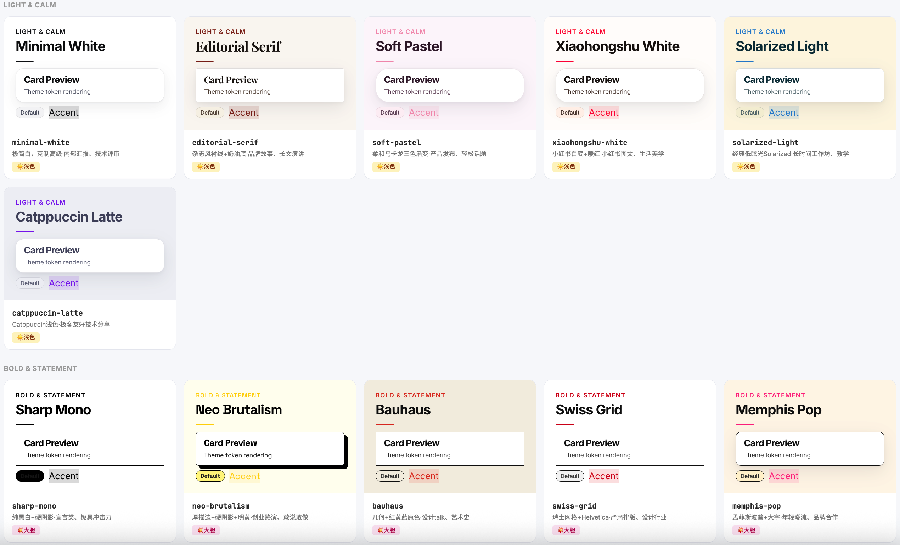

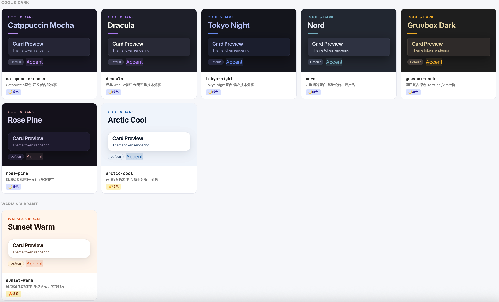

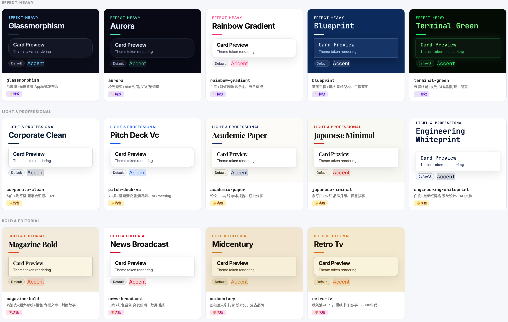

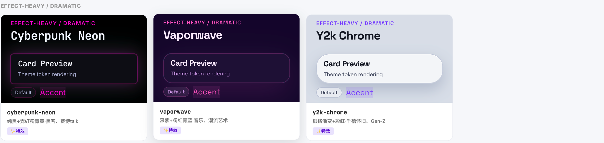

### 主题速查

| 分类 | 主题 | 适用场景 |
|------|------|----------|
| 柔和浅色 | `minimal-white` `editorial-serif` `soft-pastel` `xiaohongshu-white` `solarized-light` `catppuccin-latte` | 极简汇报、品牌故事、小红书图文、教学 |
| 大胆宣言 | `sharp-mono` `neo-brutalism` `bauhaus` `swiss-grid` `memphis-pop` | 创业路演、设计 talk、年轻潮流 |
| 暗色科技 | `catppuccin-mocha` `dracula` `tokyo-night` `nord` `gruvbox-dark` `rose-pine` `arctic-cool` | 技术分享、开发者内部分享、金融分析 |
| 温暖活力 | `sunset-warm` | 生活方式、奖项颁发 |
| 特效氛围 | `glassmorphism` `aurora` `rainbow-gradient` `blueprint` `terminal-green` | 发布会、封面页、工程蓝图、CLI 展示 |
| 专业浅色 | `corporate-clean` `pitch-deck-vc` `academic-paper` `japanese-minimal` `engineering-whiteprint` | 董事会、融资路演、学术、品牌、API 文档 |
| 编辑风格 | `magazine-bold` `news-broadcast` `midcentury` `retro-tv` | 专栏文章、数据播报、复古品牌、怀旧 |
| 戏剧张力 | `cyberpunk-neon` `vaporwave` `y2k-chrome` | 赛博 talk、潮流艺术、Gen-Z |

---

## 📐 31 种页面布局

### 什么是「页面布局」？

布局是**单页幻灯片的 HTML 骨架**——它决定了**内容怎么摆**：封面怎么设计、要点列表怎么排、数据图表放哪里、代码块怎么展示。每个布局是一个 `<section class="slide">` 代码块，带完整的 demo 数据。

| | 说明 |
|------|------|
| 类比 | 布局就像 PowerPoint 的「**版式 / 幻灯片母版**」 |
| 与主题的关系 | 主题管颜色 → 布局管结构 → 两者独立组合。同一个「双栏布局」，套上 `tokyo-night` 是暗色技术风，套上 `xiaohongshu-white` 就变成小红书风 |

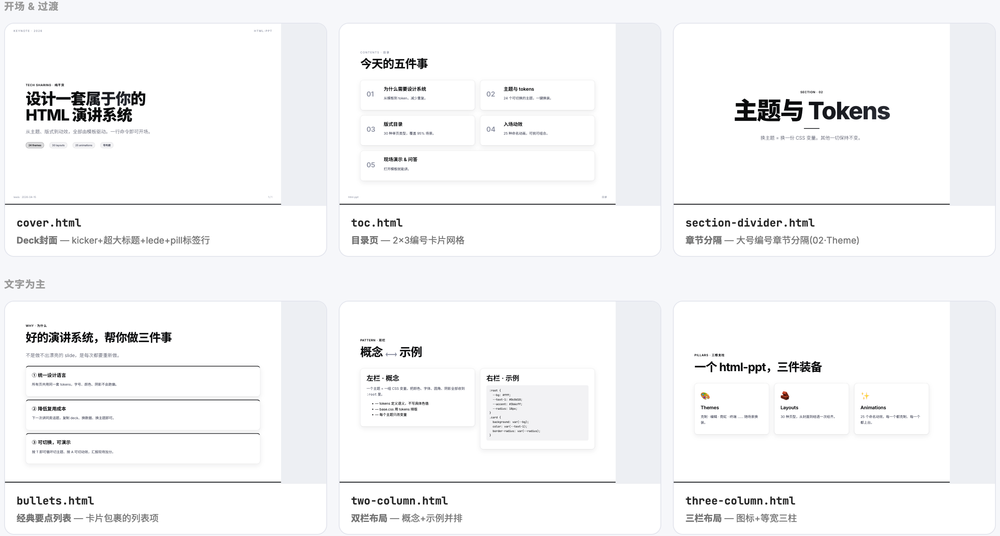

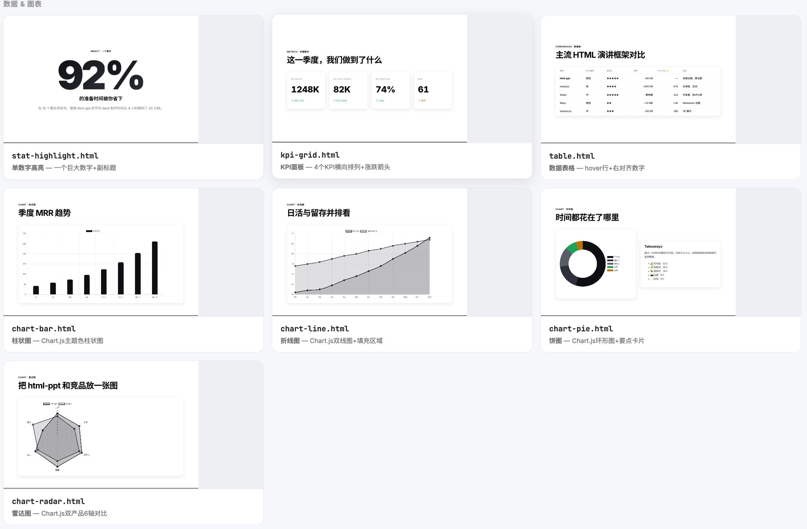

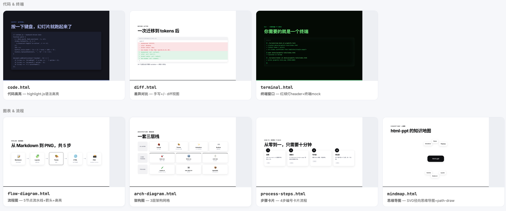

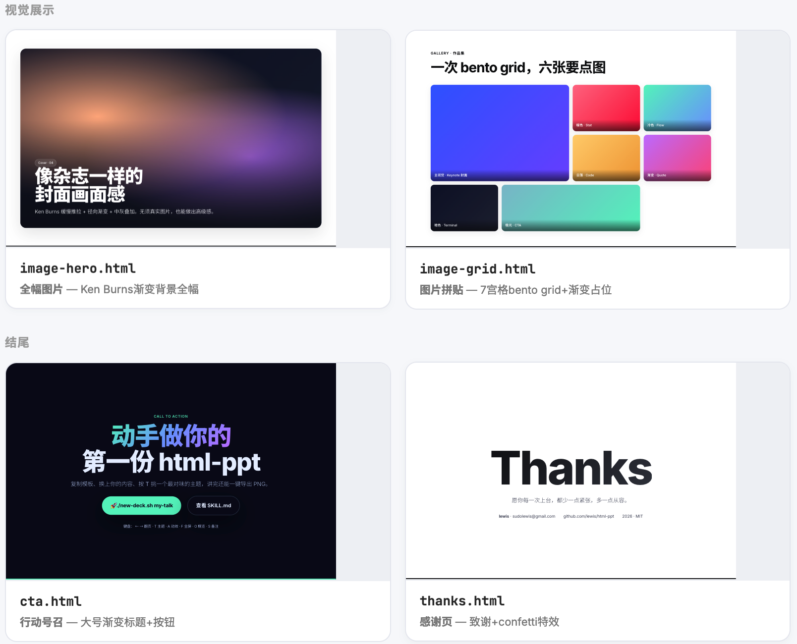

### 布局分类

| 分类 | 布局 | 用途 |
|------|------|------|
| 开场 & 过渡 | `cover` `toc` `section-divider` | Deck 封面、目录、章节分隔 |
| 文字为主 | `bullets` `two-column` `three-column` `big-quote` | 要点列表、双栏、三栏、全幅引语 |
| 数据 & 图表 | `stat-highlight` `kpi-grid` `table` `chart-bar` `chart-line` `chart-pie` `chart-radar` | 单数字、KPI、表格、柱/线/饼/雷达图 |
| 代码 & 终端 | `code` `diff` `terminal` | 代码高亮、diff 对比、终端窗口 |
| 图表 & 流程 | `flow-diagram` `arch-diagram` `process-steps` `mindmap` | 流程图、架构图、步骤卡片、思维导图 |
| 计划 & 对比 | `timeline` `roadmap` `gantt` `comparison` `pros-cons` `todo-checklist` | 时间线、路线图、甘特图、前后对比 |
| 视觉展示 | `image-hero` `image-grid` | 全幅图片、bento grid 拼贴 |
| 结尾 | `cta` `thanks` | 行动号召、感谢页 |

### 使用方式：3 步把布局变成你的页面。（也可以用自然语言描述对话更改）

以 `stat-highlight.html` 为例：

**第 1 步：打开布局源文件**，找到 `<section class="slide">`

```html
<!-- templates/single-page/stat-highlight.html（源文件） -->
<section class="slide center" data-title="Stat">
  <div style="font-size:260px;line-height:1;font-weight:900;letter-spacing:-.05em">
    <span class="counter gradient-text" data-to="92">0</span>
    <span class="gradient-text">%</span>
  </div>
  <h3>的准备时间被你省下</h3>
  <p class="lede">在 10 个真实项目中，使用 html-ppt 的平均 deck 制作时间从 4 小时降到了 20 分钟。</p>
</section>
```

**第 2 步：复制到你的 deck 中**，放在 `<div class="deck">` 里面

```html
<div class="deck">
  <!-- 已有的其他 slide -->
  <section class="slide" data-title="Cover">...</section>

  <!-- 👇 从这里粘贴 -->
  <section class="slide center" data-title="Stat">
    ...
  </section>
  <!-- 👆 粘贴到这里 -->
</div>
```

**第 3 步：替换 demo 数据** 为你自己的内容

```html
<section class="slide center" data-title="营收">
  <div style="font-size:260px;line-height:1;font-weight:900;letter-spacing:-.05em">
    <span class="counter gradient-text" data-to="58">0</span>
    <span class="gradient-text">%</span>
  </div>
  <h3>的营收同比增长</h3>
  <p class="lede">Q3 营收突破 2400 万元，主要来自新产品线的上市和市场拓展。</p>
</section>
```

> 💡 **关键技巧**：保留 `class="slide"` 和 `data-title` 不变（runtime.js 依赖它们做翻页和总览）；保留 CSS 动画相关属性（`class="counter"`、`data-to`、`gradient-text` 等）；只替换文字内容和数字。所有 31 个布局都遵循同样的规则。

---

## ✨ 47 个动效

### 什么是「动效」？

动效分两类：**CSS 入场动画**和**Canvas 持续特效**。CSS 动画是「一次性」的——元素进入幻灯片时播放一次；Canvas FX 是「持续性」的——在幻灯片展示期间一直运行。

| 类型 | 用法 | 适用场景 |
|------|------|----------|
| **CSS 动画（27 个）** | `data-anim="name"` 添加到任意元素，runtime.js 每次翻页自动重新触发 | 标题入场、列表逐行出现、数字跳动 |
| **Canvas FX（20 个）** | `data-fx="name"` 添加到容器 div，fx-runtime.js 管理生命周期 | 封面背景、数据可视化、庆祝页 |

> 💡 设计原则：一页最多 1-2 种动画，混用 5 种看起来很乱。stagger-list + 一个 hero 入场 = 干净节奏。

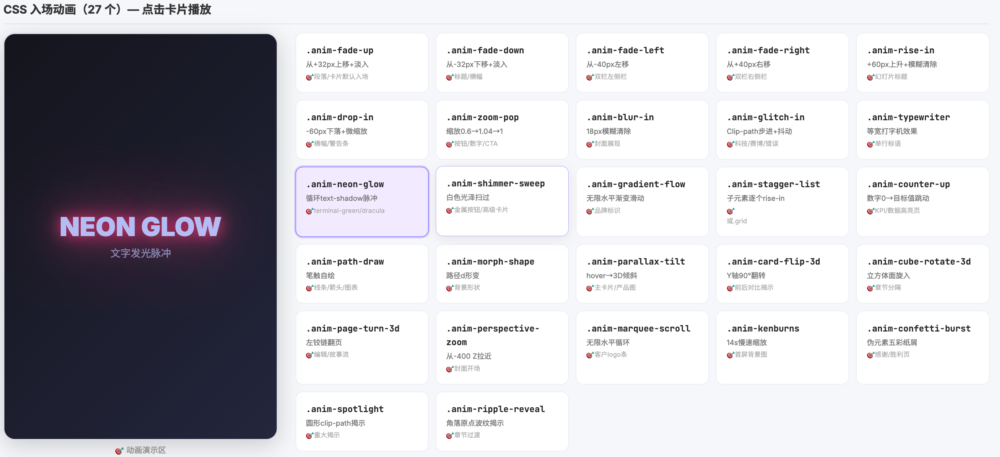

### CSS 入场动画（27 个）

| 类别 | 动画 | 效果 |
|------|------|------|
| 方向淡入 | `fade-up` `fade-down` `fade-left` `fade-right` | 从各方向平移 + 淡入 |
| 戏剧入场 | `rise-in` `drop-in` `zoom-pop` `blur-in` `glitch-in` | 上升/下落/缩放/模糊清除/抖动 |
| 文字特效 | `typewriter` `neon-glow` `shimmer-sweep` `gradient-flow` | 打字机/发光脉冲/光泽扫过/渐变流动 |
| 列表 & 数字 | `stagger-list` `counter-up` | 子元素逐个出现/数字跳动 |
| SVG 几何 | `path-draw` `morph-shape` | 笔触自绘/路径形变 |
| 3D 透视 | `parallax-tilt` `card-flip-3d` `cube-rotate-3d` `page-turn-3d` `perspective-zoom` | 倾斜/翻转/旋入/翻页/拉近 |
| 持续氛围 | `marquee-scroll` `kenburns` `confetti-burst` `spotlight` `ripple-reveal` | 滚动/慢速缩放/五彩纸屑/圆形揭示/波纹 |

### Canvas 持续特效（20 个）

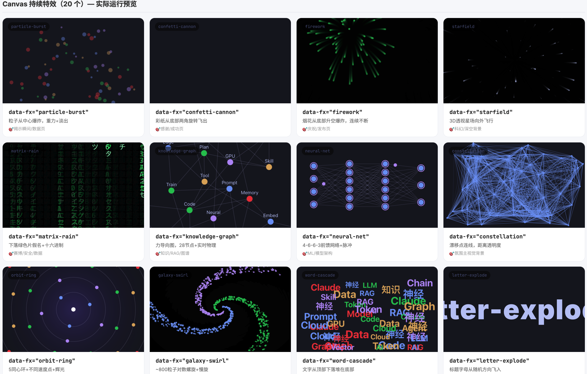

| 特效 | 效果 | 适用场景 |
|------|------|----------|
| `particle-burst` | 粒子从中心爆炸，重力+淡出 | 揭示瞬间/数据页 |
| `confetti-cannon` | 彩纸从底部两角旋转飞出 | 感谢/成功页 |
| `firework` | 烟花从底部升空爆炸，连续不断 | 庆祝/发布页 |
| `starfield` | 3D 透视星场向外飞行 | 科幻/深空背景 |
| `matrix-rain` | 下落绿色片假名+十六进制 | 赛博/安全/数据 |
| `knowledge-graph` | 力导向图，28 节点+实时物理 | 知识/RAG/图谱 |
| `neural-net` | 4-6-6-3 前馈网络+脉冲 | ML/模型架构 |
| `constellation` | 漂移点连线，距离透明度 | 氛围首屏背景 |
| `orbit-ring` | 5 同心环+不同速度点+辉光 | 系统/行星/分层 |
| `galaxy-swirl` | ~800 粒子对数螺旋+慢旋 | 封面/介绍 |
| `word-cascade` | 文字从顶部下落堆在底部 | 词汇/概念云 |
| `letter-explode` | 标题字母从随机方向飞入 | 主标题文字 |
| `chain-react` | 8 圆+多米诺脉冲波传递 | 流水线/顺序流 |
| `magnetic-field` | 粒子沿贝塞尔曲线移动+拖尾 | 能量/流/抽象 |
| `data-stream` | 滚动十六进制/二进制文本行 | 数据/API/安全 |
| `gradient-blob` | 4 个漂移模糊径向渐变 | 柔和首屏背景 |
| `sparkle-trail` | 指针驱动火花发射器 | 交互揭示/悬停画布 |
| `shockwave` | 从中心循环扩展环形波 | 冲击/发布/警报 |
| `typewriter-multi` | 3 行并行打字+闪烁光标 | 终端/Agent 启动日志 |
| `counter-explosion` | 数字跳动+粒子爆炸，4s 重置 | KPI 揭示/纪录 |

---

## 📦 15 套完整 Deck 模板

### 什么是「Deck 模板」？

Deck 模板是一份**完整的多页幻灯片文件**（通常 6-10 页），已经帮你搭配好了主题 + 布局 + 动效的组合。它不是零件，而是**可以直接用的成品**——打开 `index.html`，替换文字和图片，你的 PPT 就做好了。

| | 说明 |
|------|------|
| 类比 | Deck 模板就像 PowerPoint 的「**模板 (.potx)**」——封面、目录、内容页、图表页、结尾页全部就位 |
| 与布局/主题的区别 | 主题是配色 → 布局是单页结构 → **Deck 模板是完整的多页组合**，三者是层层递进的关系 |
| 来源 | 8 套从真实项目中提取（小红书、技术评测、架构白皮书等），7 套为通用场景脚手架（路演、发布、周报等） |

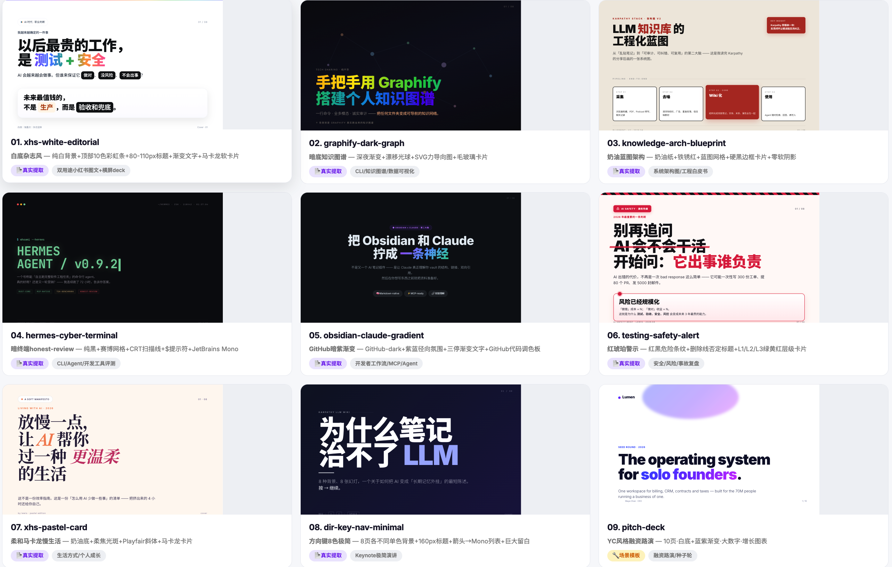

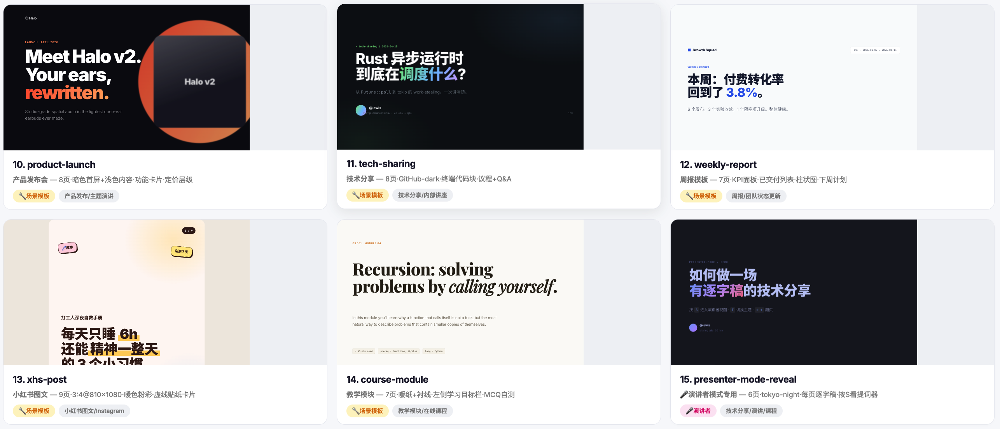

### 模板速查

| # | 模板 | 风格 | 页数 | 适用场景 |
|---|------|------|------|----------|
| 1 | `xhs-white-editorial` | 白底杂志风 | 7+ | 小红书图文+横屏 deck，中文优先 |
| 2 | `graphify-dark-graph` | 暗底知识图谱 | 7+ | CLI/知识图谱/数据可视化发布 |
| 3 | `knowledge-arch-blueprint` | 奶油蓝图架构 | 7+ | 系统架构图/工程白皮书，可打印 |
| 4 | `hermes-cyber-terminal` | 暗终端 honest-review | 7+ | CLI/Agent/开发工具评测 |
| 5 | `obsidian-claude-gradient` | GitHub 暗紫渐变 | 7+ | 开发者工作流/MCP/Agent 教程 |
| 6 | `testing-safety-alert` | 红琥珀警示 | 7+ | 安全/风险/事故复盘/红队审查 |
| 7 | `xhs-pastel-card` | 柔和马卡龙慢生活 | 7+ | 生活方式/个人成长/慢生活 |
| 8 | `dir-key-nav-minimal` | 方向键 8 色极简 | 8 | Keynote 极简演讲/发布会 |
| 9 | `pitch-deck` | YC 风格融资路演 | 10 | 融资路演/种子轮/VC 会议 |
| 10 | `product-launch` | 产品发布会 | 8 | 产品发布/发布主题演讲 |
| 11 | `tech-sharing` | 技术分享 | 8 | 技术分享/内部技术讲座 |
| 12 | `weekly-report` | 周报模板 | 7 | 周报/团队状态更新 |
| 13 | `xhs-post` | 小红书图文 | 9 | 小红书图文/Instagram 轮播（3:4） |
| 14 | `course-module` | 教学模块 | 7 | 教学模块/在线课程/工作坊 |
| 15 | `presenter-mode-reveal` 🎤 | 演讲者模式专用 | 6 | 技术分享/演讲/课程——需要逐字稿 |

---

## ⚡ 功能特性

### ⌨️ 键盘操控

| 按键 | 功能 |
|------|------|
| `←` `→` `Space` | 翻页导航 |
| `F` | 全屏 |
| `T` | 循环切换主题 |
| `S` | 演讲者模式（独立弹出窗口） |
| `P` | 导出对话框 |
| `O` | 幻灯片总览网格 |
| `N` | 演讲备注抽屉 |
| `R` | 重置计时器 |
| `A` | 测试当前页动画 |
| `Esc` | 关闭所有叠加层 |

### 🎤 演讲者模式（按 `S` 键）

- 在任何 deck 里按 `S` 键，弹出一个独立的演讲者窗口，包含 4 个**可拖拽、 可调整大小的磁吸卡片**：当前页预览、下一页预览、逐字稿、计时器。两个窗口 通过 `BroadcastChannel` 双向同步翻页。

- 演讲者模式是一个**独立弹出窗口**，在你演讲时显示在演讲者自己的屏幕上（观众看不到）。它解决了演讲者最核心的焦虑——**「下一页是什么？」「我讲到哪了？」「时间够吗？」「这段话怎么说？」**

| | 说明 |
|------|------|
| 类比 | 就像 PowerPoint 的「演示者视图」——观众看到全屏幻灯片，演讲者看到备注+下一页+计时器 |
| 核心技术 | 每张幻灯片 `<aside class="notes">` 写逐字稿（150–300 字），按 `S` 弹出窗口显示大字体提词器；当前页和下一页用 iframe 像素级预览（加载同一份 HTML + CSS） |
| 卡片可拖拽缩放 | 4 张磁吸卡片的位置和大小自动保存到 localStorage，每个 deck 独立记忆 |

| 卡片 | 内容 |
|------|------|
| 🔵 CURRENT | 当前幻灯片 — 像素级 iframe 预览 |
| 🟣 NEXT | 下一页预览 — 提前准备过渡 |
| 🟠 SPEAKER SCRIPT | 逐字稿提词器 — 大字体可滚动，150–300 字/页 |
| 🟢 TIMER | 计时器 + 页码 — `←` `→` 翻页 · `R` 重置 |

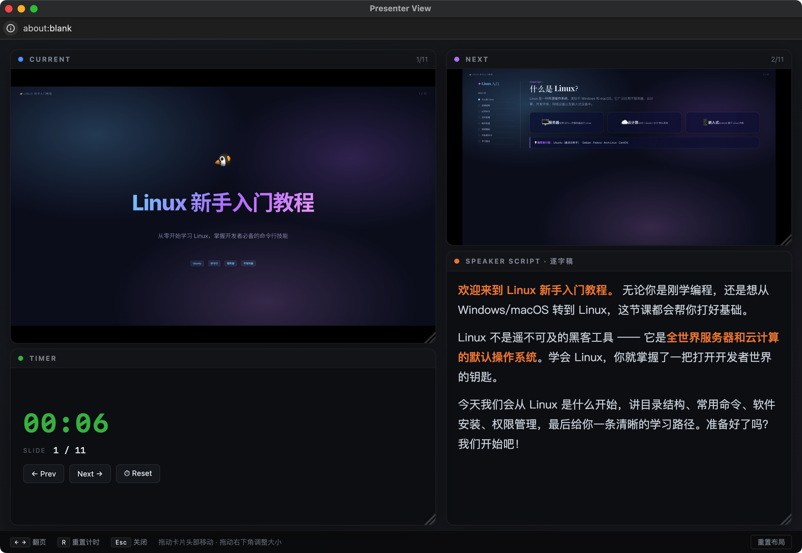

**为什么预览是像素级完美的：** 每个卡片是一个 `<iframe>`，加载的是**同一 份 deck HTML 文件**，只是 URL 多了 `?preview=N` 参数。runtime 检测到这个 参数后，只渲染第 N 页并隐藏所有 chrome —— 所以预览使用**和观众视图完全相 同的 CSS、主题、字体、viewport**，颜色和排版保证 100% 一致。

**丝滑翻页（零闪烁）：** 翻页时演讲者窗口通过 `postMessage({type:'preview-goto', idx:N})` 通知 iframe，iframe 只是切换 `.is-active` class —— **不重新加载、 不白屏、不闪烁**。

**逐字稿 3 条铁律：**

1. **提示信号，不是讲稿** — 关键词加粗，过渡句独立成段
2. **每页 150–300 字** — 约 2–3 分钟/页的节奏
3. **用口语，不用书面语** — "所以" 不是 "因此"，"这个" 不是 "该"

详见 [`references/presenter-mode.md`](https://github.com/lewislulu/html-ppt-skill/blob/main/references/presenter-mode.md)，或直接复制 `templates/full-decks/presenter-mode-reveal/` 这个现成模板 —— 每一页都带完整 150–300 字的示例逐字稿。

### 📦 一键导出（按 `P` 键）

| 格式 | 说明 |
|------|------|
| PDF (SVG) | 浏览器打印 → 矢量 PDF |
| PDF (PNG) | Canvas 渲染 → 位图 PDF |
| SVG (.zip) | 每页独立 SVG 打包下载 |
| PNG (.zip) | 每页独立 PNG 打包下载 |

---

## 设计理念

- **Token 驱动的设计系统。** 所有颜色、圆角、阴影、字体决策都在 `assets/base.css` + 当前主题文件里。改一个变量，整份 deck 优雅地重排。
- **Iframe 隔离预览。** 主题 / 布局 / 完整 deck 的 showcase 都用 `<iframe>`， 确保每个预览都是真实、独立的渲染结果。
- **零构建。** 纯静态 HTML/CSS/JS。webfont 走 Google Fonts CDN，SVG 导出按需加载 JSZip CDN。
- **资深设计师的默认值。** 字号规律、间距节奏、渐变、卡片处理都有态度 —— 绝不是 "PowerPoint 2006" 那种味道。
- **中英文并重。** 预导入了 Noto Sans SC / Noto Serif SC。

---

## 许可证

- 继承 [lewislulu/html-ppt-skill](https://github.com/lewislulu/html-ppt-skill)仓库的MIT协议。 

- MIT · Copyright (c) 2026 ostar999 &lt;ota1754@qq.com&gt;
